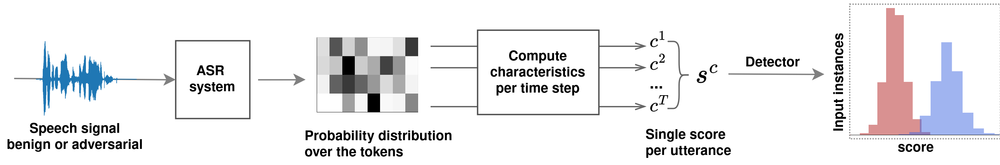

# [UAI 2024] DistriBlock: Identifying adversarial audio samples by leveraging characteristics of the output distribution.

We propose DistriBlock, a novel detection method for adversarial attacks on neural network-based ASR systems. 
We show that characteristics of the distribution over the output tokens can serve as features of binary classifiers.



This paper [DistriBlock: Identifying adversarial audio samples by leveraging characteristics of the output distribution](https://arxiv.org/abs/2305.17000) has been accepted to UAI 2024. A demo with a selection of benign, adversarial, and noisy data employed in our experiments is available online: [DistriBlock Demo](https://matiuste.github.io/Distriblock_demo/).
> Adversarial attacks can mislead automatic speech recognition (ASR) systems into predicting an arbitrary target text, thus posing a clear security threat.
> To prevent such attacks, we propose DistriBlock, an efficient detection strategy applicable to any ASR system that predicts a probability distribution over output tokens in each time step.
> We measure a set of characteristics of this distribution: the median, maximum, and minimum over the output probabilities, the entropy of the distribution, as well as the Kullback-Leibler and the Jensen-Shannon divergence with respect to the distributions of the subsequent time step. 
> Then, by leveraging the characteristics observed for both benign and adversarial data, we apply binary classifiers, including simple threshold-based classification, ensembles of such classifiers, and neural networks. 
> Through extensive analysis across different state-of-the-art ASR systems and language data sets, we demonstrate the supreme performance of this approach, with a mean area under the receiver operating characteristic curve for distinguishing target adversarial examples against clean and noisy data of 99\% and 97\%, respectively. 
> To assess the robustness of our method, we show that adaptive adversarial examples that can circumvent DistriBlock are much noisier, which makes them easier to detect through filtering and creates another avenue for preserving the system's robustness.

## Prerequisites
Before running the Distriblock scripts, the following tasks need to be completed:
1. SpeechBrain installation
2. Download datasets
3. Download pre-trained ASR models
4. Generate adversarial examples
   
#### 1. SpeechBrain installation
We analyze a variety of fully integrated PyTorch-based deep learning E2E speech engines using [SpeechBrain](https://github.com/speechbrain/speechbrain). 
Please refer to their website for instructions on how to install it.
We perform evaluations of our detectors using an NVIDIA A40 GPU with 48 GB of memory, along with ASR recipes from SpeechBrain version 0.5.14.

#### 2. Download datasets
We use the following large-scale speech corpus:
* [LibriSpeech (English)](https://www.openslr.org/12)
* [Aishell (Chinese Mandarin)](https://www.openslr.org/33/)
* [Common Voice 6.1 (German and Italian)](https://commonvoice.mozilla.org/en/datasets)

#### 3. Download pre-trained ASR models
We provide our [pre-trained models](https://ruhr-uni-bochum.sciebo.de/s/lpjW0vxFikG2WqD) that can be used to generate adversarial examples and to test our Distriblock defense strategy.
In addition, Speechbrain contains pre-trained models that can also be used:
* [CRDNN with CTC/Attention trained on CommonVoice Italian](https://huggingface.co/speechbrain/asr-crdnn-commonvoice-it)
* [CRDNN with CTC/Attention trained on LibriSpeech](https://huggingface.co/speechbrain/asr-crdnn-rnnlm-librispeech)
* [wav2vec 2.0 with CTC trained on Aishell](https://huggingface.co/speechbrain/asr-wav2vec2-ctc-aishell)
* [wav2vec 2.0 with CTC trained on CommonVoice German](https://huggingface.co/speechbrain/asr-wav2vec2-commonvoice-de)
* [Transformer trained on Aishell](https://huggingface.co/speechbrain/asr-transformer-aishell)
* [Transformer trained on LibriSpeech](https://huggingface.co/speechbrain/asr-transformer-transformerlm-librispeech)
  
#### 4. Adversarial attacks
To generate Adversarial Examples, we utilized [RobustSpeech](https://github.com/RaphaelOlivier/robust_speech), a repository that contains a PyTorch implementation of all considered attacks in our paper.
Please refer to their website for instructions on how to generate adversarial examples. 

As an example, csv files for Librispeech corpus and its corresponding CW adversarial examples, along with the target transcription, are provided in the results folder. These files can also be used to generate the adversarial examples. 
The data should be stored using the following folder structure:
```
data_set
└──librispeech
    ├── test-clean
    ├── cw
    ├── ...
└──aishell
    ├── test-clean
    ├── cw
    ├── ...
└──cv-italian
    ├── test-clean
    ├── cw
    ├── ...
└──cv-german
    ├── test-clean
    ├── cw
    ├── ...
```
## Running the experiments
The scripts below have been tested on a Transformer ASR model trained on LibriSpeech. You can download the pre-trained model from [here](https://ruhr-uni-bochum.sciebo.de/s/lpjW0vxFikG2WqD). These scripts can be easily adjusted for any SpeechBrain recipe. 

### Computing Characteristics
To compute the characteristics of the output distribution run the script as follows:
```
python distriblock_characteristics.py hparams/transformer.yaml
```
We use the hyperparameter file just like in any SpeechBrain recipe. The default `attack_type` hyperparameter refers to the `CW` attack. Change this hyperparameter and csv files if testing another type of adversarial attack.

### Building and evaluating binary classifiers
The extracted characteristics of the output distribution are used as features for different binary classifiers. To train and evaluate the classifiers use:
```
python distriblock_classifiers.py -h

usage: distriblock_classifiers.py [-h] FOLDER_ORIG FOLDER_ADV

positional arguments:
  FOLDER_ORIG  Folder path that contains the characteristics of the benign examples.
  FOLDER_ADV   Folder path that contains the characteristics of the adversarial examples.```

options:
  -h, --help   show this help message and exit
```
Example for evaluating Distriblock defense against CW attack:
```
python distriblock_classifiers.py DistriBlock_data DistriBlock_data/CW/
```
### Using filtering to preserve model robustness
To evaluate Low-pass and Spectral-Gating filters to preserve system robustness, run the following script:
```
python distriblock_filtering.py hparams/transformer.yaml
```
Again, change the hyperparameters in the YAML file and CSV files if testing another type of adversarial attack.

### Citation
If you find value in this repository, please consider citing the preprint of our paper:
```bibtex
@inproceedings{
Pizarro2024DistriBlock,
title={DistriBlock: Identifying adversarial audio samples by leveraging characteristics of the output distribution},
author={Pizarro, Matías and Kolossa, Dorothea and Fischer, Asja},
booktitle={The 40th Conference on Uncertainty in Artificial Intelligence},
year={2024},
}
```
